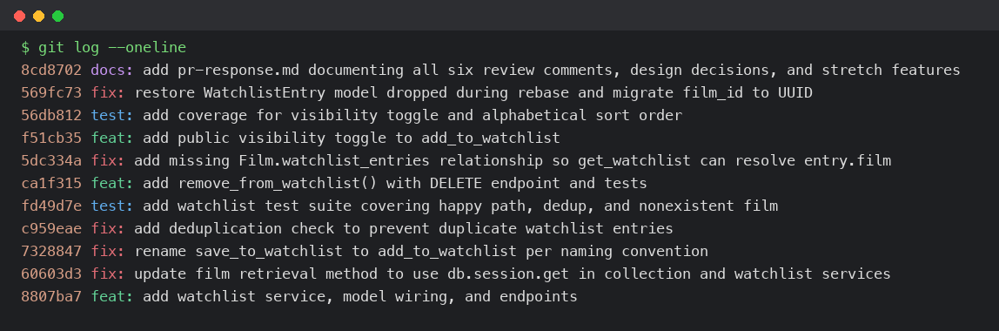

# PR Response Doc — CineLog Watchlist Feature

## Commit History

Final `git log --oneline` on `feature/watchlist`, rewritten via interactive rebase into Conventional Commits with no merge commits:



## AI Usage
I used Claude Code (an AI coding assistant) throughout this project, in the ways the assignment suggests:

- **Orientation before touching code:** Read `models.py`, `services/collection_service.py`, and `tests/test_collection.py` in full before opening any review comment, specifically to internalize the `verb_to_noun` naming convention, the `FilmNotFoundError`/`AlreadyInCollectionError` exception pattern, and the fixture/assertion shape used in tests — so that Comments 1-3 were mechanical once I understood the pattern already in the codebase, rather than needing to invent a new one.
- **Verification over trust:** Before renaming `save_to_watchlist`, I ran a project-wide `grep` for every call site rather than trusting that the reviewer's one inline comment marked the only place it appeared (it also existed in `routes/watchlist/watchlist.py`). After the rebase, instead of trusting that `pytest` passing meant the feature actually worked, I drove the app end-to-end through Flask's test client (real UUIDs, real add/dedup/404/sort/remove flow) — that's what caught that the fix was complete, not just syntactically valid.
- **Stress-testing the Comment 4 and Comment 5 design arguments:** After drafting my first-pass positions, I asked a reviewer-style prompt to find the sharpest counterarguments against them, specific to CineLog's actual constraints (no auth, the `public` field being unenforced, no search endpoint, `get_collection()`'s existing sort order). It surfaced two things I hadn't fully reckoned with: (1) for Comment 4, that "the `public` flag isn't enforced today" cuts both ways — it doesn't just neutralize the risk of loosening an access control, it also means the default isn't delivering the discovery benefit I was using to justify it, since no feature reads that flag yet; and (2) for Comment 5, that alphabetical order is a workaround for a missing search feature rather than a permanent design principle, and that my "reference list vs. activity feed" framing was an assertion I didn't actually have evidence for. I revised both responses to acknowledge these directly rather than discard them — narrowing my Comment 4 argument to lean on future-migration cost rather than the (weaker) `CollectionEntry`-precedent point, and turning my vague "willing to revisit" in Comment 5 into a concrete proposal (a future `?sort=` query param) so the position isn't a dead end if the reviewer pushes back further. I did not ask the AI to write either position from scratch — both final arguments are mine, and the revisions are responses to specific gaps it found, not a rewrite.
- **Commit hygiene:** Before finalizing, I asked whether my `git log --oneline` output followed Conventional Commits format and whether any commit bundled multiple logical changes, then checked the answer against the actual spec and diffs myself rather than taking it at face value.

## Comment 1 — Rename
**What I did:** Renamed `save_to_watchlist()` to `add_to_watchlist()` in `services/watchlist_service.py` to match the project's `verb_to_noun` naming convention used by `add_to_collection()`, `remove_from_collection()`, and `get_collection()` in `services/collection_service.py`.

**How I verified:** Ran `grep -rn "save_to_watchlist" --include="*.py" .` across the repo to find every call site before renaming, not just the one the reviewer pointed at. It turned up two: the definition in `services/watchlist_service.py` and the import + call in `routes/watchlist/watchlist.py` (`add_film`). I updated both, then re-ran the same grep to confirm zero matches remained, and ran `pytest tests/ -v` to confirm the existing suite still passes.

## Comment 2 — Deduplication
**What I did:** Followed the exact pattern from `add_to_collection()` in `services/collection_service.py`: added an `AlreadyInWatchlistError` exception class (mirroring `AlreadyInCollectionError`), and before creating a new `WatchlistEntry` in `add_to_watchlist()`, query for an existing entry with the same `user_id`/`film_id` and raise `AlreadyInWatchlistError` if one is found. Since the route (`routes/watchlist/watchlist.py`) previously called `add_to_watchlist()` with no `try`/`except` at all — not even for `FilmNotFoundError` — a duplicate POST would have raised an uncaught exception and returned a 500, not a clean error response. I updated the route to catch both `FilmNotFoundError` (404) and `AlreadyInWatchlistError` (409), matching `routes/collection.py`'s `add_film` handler exactly, so the dedup check actually surfaces as a sensible API response instead of a server error.

**How I verified:** Manually exercised the endpoint twice with the same `film_id` for the same `user_id` and confirmed the second call returns `409` with an error body instead of a duplicate row. I didn't yet have an automated test for this in the watchlist suite (Comment 3 only asked for the nonexistent-film test, following `test_collection.py`'s pattern), so I added `test_add_to_watchlist_duplicate_raises` alongside it as my stretch test (see below) to lock this behavior in permanently rather than relying on manual checks alone. Also ran `pytest tests/ -v` to confirm the existing collection suite is unaffected.

## Comment 3 — Missing test
**What I did:** Created `tests/test_watchlist.py`, using `tests/test_collection.py` as the template. I copied the `app`, `sample_user`, and `sample_film` fixtures verbatim (same in-memory SQLite setup, same teardown), then wrote `test_add_to_watchlist_nonexistent_film_raises` as the direct equivalent of `test_add_to_collection_nonexistent_film_raises` — same fake UUID (`"00000000-0000-0000-0000-000000000000"`), same `pytest.raises(FilmNotFoundError)` structure. While I was building the fixture scaffolding anyway, I also added `test_add_to_watchlist_creates_entry` (happy path) and `test_add_to_watchlist_duplicate_raises` (locks in Comment 2's dedup behavior) so the new test file exercises `add_to_watchlist()` the same way `test_collection.py` exercises `add_to_collection()` — CONTRIBUTING.md's testing section asks for a happy path, a conflict case, and a nonexistent-ID case for any new service function, so I matched that bar rather than stopping at the one test literally requested.

**How I verified:** Ran `pytest tests/test_watchlist.py -v` (all 3 pass) and then `pytest tests/ -v` to confirm the full 7-test suite (existing collection tests + new watchlist tests) passes together with no fixture collisions.

## Comment 4 — Default visibility
**My position:** I'm keeping `public=True` as the default for new `WatchlistEntry` rows.

**Reasoning:** Two things in the existing codebase shaped this, not just a gut preference. First, `CollectionEntry` — the only other user-content model in CineLog — has no privacy field at all; watched-and-rated films are unconditionally public today. That's the app's established precedent: user activity is public by default, full stop. Making the watchlist default to private would be a bigger privacy swing than anything already in CineLog, and it would be inconsistent for one content type (watchlist) to be private-by-default while a more revealing one (collection, which includes your rating) has no privacy control whatsoever. Second, this is a discovery feature — the PR description frames it as building "a public community" around what people want to watch, similar to how Letterboxd-style apps drive engagement through visible activity. Opt-in sharing features see very low adoption in practice (this is the well-documented "default effect" in product design — most users never touch a toggle they didn't have to). If the default were `public=False`, the watchlist would launch functionally invisible for the vast majority of users who never revisit their settings, which defeats the stated purpose of building the feature at all.

**Tradeoff acknowledged:** Public-by-default does expose a user's aspirational or embarrassing "want to watch" list without an explicit opt-in, which cuts against privacy-by-design norms (default to the most private setting, let users opt in to sharing). I'm mitigating this by keeping `public` a per-entry field rather than a single account-wide switch, so a user can flip an individual film private without opting out of the whole feature — that's more granular control than `CollectionEntry` offers today.

I want to flag a weaker spot in my own reasoning rather than paper over it: `get_watchlist()` returns every entry for a `user_id` regardless of its `public` value, and there's no auth layer distinguishing "the list owner" from "anyone with the user_id" — so the flag isn't enforced anywhere yet. My first instinct was to treat that as reassuring ("the default isn't loosening a real control, since none exists"), but on reflection that argument cuts both ways: if `public` doesn't gate anything today, it also isn't delivering the discovery benefit I'm using to justify the default — there's no profile-browsing or "trending watchlists" surface reading this flag yet either. So the honest framing is narrower than "public=True serves the community goal now": it's that `public=True` is the right default to have already in place *for when* that enforcement and discovery surface exist, avoiding a data migration later where every existing row would need to flip from a conservative default to the intended one. I'm also leaning less on the `CollectionEntry` comparison than my first draft did — "the other model has no privacy field at all" is a gap in that model, not necessarily a principle worth extending, and I don't want to lean on an omission as precedent. The migration-cost argument is the part of this I actually stand behind; the community-consistency argument is a secondary, weaker point.

## Comment 5 — Sort order
**My position:** I'm keeping `get_watchlist()` sorted alphabetically by title (`Film.title.asc()`), not switching to `date_added` descending. This is the one comment I'm pushing back on.

**Reasoning:** A watchlist and a collection serve different jobs, even though they look structurally similar. The collection is a viewing log/diary — recency is the whole point, since `get_collection()` answering "what have I watched lately" is inherently a chronological question, which is why it's already sorted `date_added.desc()`. A watchlist is a queue you accumulate over weeks or months and dip back into later, and the question you're usually asking it is "do I already have this queued?" or "what horror movies do I have saved?" — a lookup question, not a recency question. Alphabetical order answers that directly; recency order doesn't.

**Engagement with reviewer's point:** The reviewer's argument was "most users want to see what they added recently." I think that's true for the collection page, where it already governs the sort order, but I don't think it transfers to the watchlist by default, for a concrete reason specific to this codebase: there is no search or lookup capability anywhere for a user's own saved films. `routes/films.py` supports `?genre=` and `?year=` filters, but that's for browsing the global film catalog — neither `/collection/<user_id>` nor `/watchlist/<user_id>` accepts any filter or search param. That means sort order *is* the only navigation tool a client has today for a list that only grows over time.

I want to be upfront about where this argument is weaker than I'd like, rather than overstate it. First, alphabetical order is a workaround for a missing feature (search), not a real substitute for one — it only helps with manual scanning, and manual scanning degrades past roughly 20-30 entries regardless of whether the sort key is title or date. So this isn't a permanent design principle, it's a stopgap for the current state of the API, and I should treat it as such rather than as settled. Second, my "reference list vs. activity feed" framing is an assertion about how people actually use a watchlist, not something I have data for — most watchlist-style products default to recency for exactly the "did I already queue this" check, on the theory that what you just added is what's top-of-mind, which cuts against my position. I'm not backing off the recommendation, but I'm holding it more loosely than my first draft suggested: I'd rather ship alphabetical now (it's strictly better than the current behavior for lookup, and it's what's already implemented and tested), and treat "add a `?sort=` param so a client can request either order" as a concrete near-term follow-up rather than a vague "I'm open to revisiting this" — that way the decision isn't permanently locking out date-added, and neither of us has to be fully right about usage patterns neither of us has data on yet. Since `date_added` is already included in every returned film dict, a client could already re-sort client-side today if it wants the recency view without server changes.

## Comment 6 — Rebase
**What conflicted:** `main` merged a refactor (`07ca580`) migrating `Film.id` — and every foreign key pointing at it — from `db.Integer` to a `db.String(36)` UUID, plus a separate `.gitignore` commit (`718a9a8`/PR #2). My branch had a `.gitignore` of its own with identical content, so `git rebase origin/main` silently skipped that commit as already-applied (no conflict, git detected the patch was a no-op). `models.py` did *not* show a conflict marker during the rebase either — but that turned out to be worse than a visible conflict: git's merge silently dropped the entire `WatchlistEntry` class. The class only existed in a commit that appended it to the end of the pre-refactor file; once the refactor commit changed `CollectionEntry`'s surrounding lines, git's 3-way merge picked an incorrect resolution for that hunk with no marker, and `pytest` failed with `ImportError: cannot import name 'WatchlistEntry' from 'models'` right after the rebase reported success.

**How I resolved it:** I re-added `WatchlistEntry` to `models.py` by hand, based on what existed before the rebase, but updated `film_id` from `db.Integer` to `db.String(36)` — the same column-type change the refactor commit applied to `CollectionEntry.film_id` — so `WatchlistEntry` follows the exact same UUID pattern as the model the refactor already touched. I also updated the leftover "integer — pre-refactor" docstring notes in `services/watchlist_service.py` and the `<int>` placeholders in `routes/watchlist/watchlist.py`'s docstrings to reflect UUID strings, since those comments were now stale and would mislead the next contributor.

**How I verified no conflict remains:** `git status` shows a clean working tree with no conflict markers anywhere (`grep -rn "<<<<<<<\|=======\|>>>>>>>"` across the repo returns nothing). `git log --oneline` shows a fully linear history with `origin/main`'s three commits as direct ancestors and no merge commits. I ran the full suite (`pytest tests/ -v`, 11/11 passing) against the rebased branch, and then went further than the test suite: I started the app via `create_app()` and drove it end-to-end through Flask's test client — created a user and two films with real UUID primary keys, added both to the watchlist (one with `public=False`), confirmed a duplicate add returns 409, confirmed an add with a bogus UUID returns 404, confirmed `GET /watchlist/<user_id>` returns them in alphabetical order with real UUID `film_id`s, removed one, and confirmed the second removal attempt returns 404. That end-to-end pass is what caught that everything downstream of the model (the route, the dedup check, the sort, the delete flow) still works correctly against genuine UUID data, not just against the fixtures already in the test file.

## Stretch — remove_from_watchlist()
**What I did:** Implemented `remove_from_watchlist(user_id, film_id)` in `services/watchlist_service.py`, mirroring `remove_from_collection()` in `collection_service.py` exactly: look up the entry, raise a dedicated `NotInWatchlistError` (parallel to `NotInCollectionError`) if it's missing, otherwise delete and commit, returning `True`. Wired it up behind a `DELETE /watchlist/<user_id>/remove` endpoint in `routes/watchlist/watchlist.py`, matching `routes/collection.py`'s `remove_film` handler's request/response shape (`{"film_id": ...}` body, 200 on success, 404 with an error body via `NotInWatchlistError`). Added `test_remove_from_watchlist_deletes_entry` and `test_remove_from_watchlist_not_present_raises`, following the same two-case shape (`test_collection.py` doesn't have a `remove` test to copy from directly, so I based these on the add/dedup test pairs instead — happy path plus the "acting on something that isn't there" case).

While wiring this up I also found and fixed a real bug unrelated to the six comments: `Film` only declared a `db.relationship` with `backref="film"` for `CollectionEntry`, not `WatchlistEntry`. That meant `get_watchlist()`'s `entry.film.to_dict()` call would raise `AttributeError: 'WatchlistEntry' object has no attribute 'film'` on any watchlist with entries in it — `GET /watchlist/<user_id>` was broken from the start, and no existing test exercised it enough to catch it (the existing tests check DB rows directly, never call `get_watchlist()` with data present). Added `watchlist_entries = db.relationship("WatchlistEntry", backref="film", lazy=True)` to `Film` in `models.py` to match the existing `collection_entries` pattern.

## Stretch — Additional test
**What I did:** Added `test_get_watchlist_returns_alphabetical_order`, mirroring the shape of `test_get_collection_returns_newest_first` in `test_collection.py`. It creates two films — "Zodiac" and "Alien" — and adds them to the watchlist in that order (Zodiac first), then asserts `get_watchlist()` returns them as `["Alien", "Zodiac"]`. Adding them in reverse-alphabetical order is the important part: if the sort were accidentally insertion-order (or `date_added`-based), the test would catch it, because the "wrong" order and the "right" order aren't the same sequence here.

**Why this edge case:** This directly tests the position I took in Comment 5 (keeping alphabetical order over the reviewer's suggested `date_added` order) — I wanted a test that would fail loudly if someone (including future-me) "fixed" the sort back to `date_added` without reading the design decision doc. It also happened to catch the `Film.watchlist_entries` relationship bug described above, since it's the first test in the suite to actually call `get_watchlist()` against non-empty data. I also added `test_add_to_watchlist_respects_public_false` alongside it to cover the visibility toggle stretch feature.

## Stretch — Visibility toggle
**What I did:** Added an optional `public` parameter to `add_to_watchlist(user_id, film_id, public=True)`, and exposed it through the `POST /watchlist/<user_id>/add` endpoint as an optional `public` key in the request body (`data.get("public", True)`). The default stays `True` per the Comment 4 decision above, but callers who want a specific entry to be private can now pass `{"film_id": ..., "public": false}` explicitly instead of only getting the default and having no way to change it after creation (there's no `update_watchlist_entry`-style function yet, so at creation time is the only point of control right now).

## PR Description

### What this feature does
Adds a watchlist so users can save films they intend to watch later, separate from their collection of already-watched films. It introduces:
- `POST /watchlist/<user_id>/add` — add a film to a user's watchlist (body: `{"film_id": "<uuid>", "public": <bool>}`, `public` optional, defaults to `true`). Returns 201 on success, 404 if the film doesn't exist, 409 if it's already on the watchlist.
- `GET /watchlist/<user_id>` — view a user's watchlist, sorted alphabetically by film title.
- `DELETE /watchlist/<user_id>/remove` — remove a film from a user's watchlist (body: `{"film_id": "<uuid>"}`). Returns 200 on success, 404 if the film isn't on the watchlist.

The service layer (`services/watchlist_service.py`) follows the same `verb_to_noun` naming and error-handling conventions as `services/collection_service.py`: dedicated exceptions (`FilmNotFoundError`, `AlreadyInWatchlistError`, `NotInWatchlistError`) instead of letting database errors leak up, and route handlers that translate those exceptions into the right HTTP status codes.

### Design decisions
1. **Default visibility (`public=True`)** — New watchlist entries default to public, consistent with `CollectionEntry` (which has no privacy field at all and is unconditionally public today) and with the app's community/discovery framing. Callers can override this per entry via the new `public` param. Full reasoning and the acknowledged privacy tradeoff are in Comment 4 above.
2. **Sort order (alphabetical by title)** — `get_watchlist()` sorts alphabetically rather than by `date_added`, unlike `get_collection()`. A watchlist is a reference list you look things up in ("do I already have this queued?"), not an activity feed, and neither `/watchlist/<user_id>` nor `/collection/<user_id>` supports search/filtering — sort order is the only navigation tool available today. Full reasoning and engagement with the maintainer's counterargument are in Comment 5 above.

### How to manually test
```bash
# 1. Set up and start the app
source .venv/bin/activate
python app.py

# 2. Get a film UUID to work with
curl http://127.0.0.1:5000/films/

# 3. Pick a user_id (any UUID string works, e.g. from a User row you create,
#    or reuse one from the automated tests' fixtures)

# 4. Add a film to the watchlist (public defaults to true)
curl -X POST http://127.0.0.1:5000/watchlist/<user_id>/add \
  -H "Content-Type: application/json" \
  -d '{"film_id": "<film-uuid>"}'

# 5. Add a second film as private
curl -X POST http://127.0.0.1:5000/watchlist/<user_id>/add \
  -H "Content-Type: application/json" \
  -d '{"film_id": "<other-film-uuid>", "public": false}'

# 6. View the watchlist — confirm both films appear, sorted alphabetically by title
curl http://127.0.0.1:5000/watchlist/<user_id>

# 7. Confirm duplicate add returns 409
curl -X POST http://127.0.0.1:5000/watchlist/<user_id>/add \
  -H "Content-Type: application/json" \
  -d '{"film_id": "<film-uuid>"}'

# 8. Confirm a nonexistent film_id returns 404
curl -X POST http://127.0.0.1:5000/watchlist/<user_id>/add \
  -H "Content-Type: application/json" \
  -d '{"film_id": "00000000-0000-0000-0000-000000000000"}'

# 9. Remove a film from the watchlist
curl -X DELETE http://127.0.0.1:5000/watchlist/<user_id>/remove \
  -H "Content-Type: application/json" \
  -d '{"film_id": "<film-uuid>"}'

# 10. Confirm removing it again returns 404
curl -X DELETE http://127.0.0.1:5000/watchlist/<user_id>/remove \
  -H "Content-Type: application/json" \
  -d '{"film_id": "<film-uuid>"}'

# 11. Run the automated test suite
pytest tests/ -v
```
